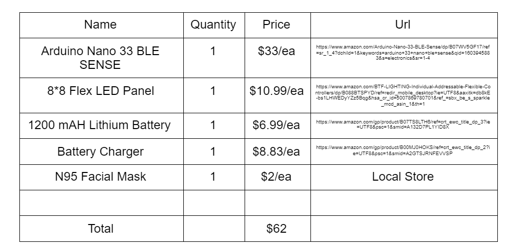
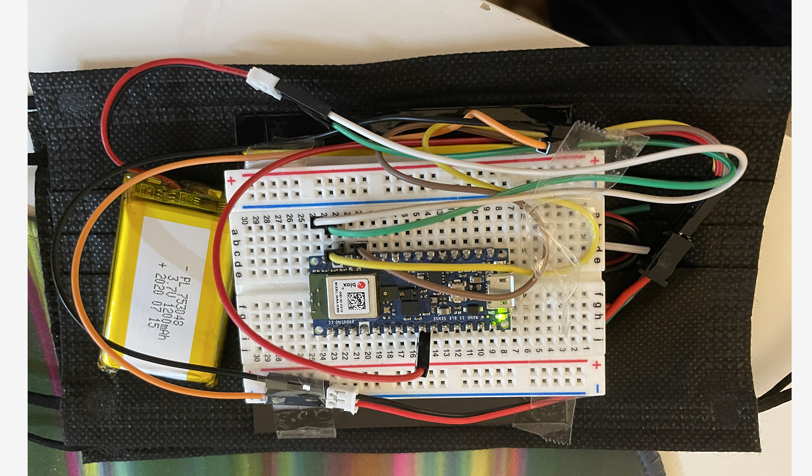
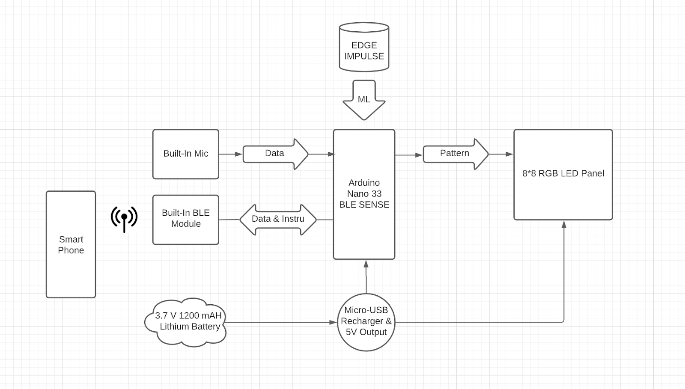
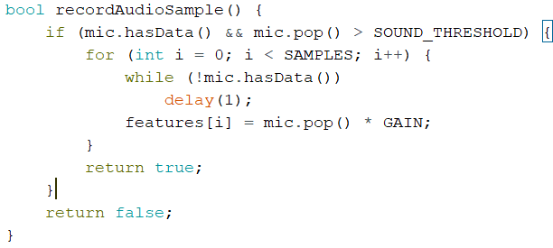
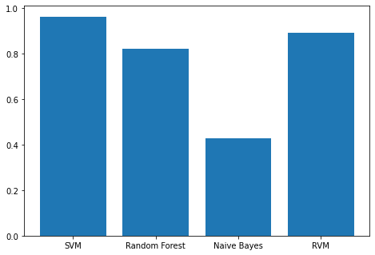

# ECE_M202A_MASK --- TEAM CL

This Project is for ECE M202A at UCLA

## Team Member:
Hongyi Chen

Rui Lin

## Overview
---
### Motivation
Under the tough COVID-19 pandemic, thousands of people lost their lives and lots of hospitals' ICUs are hitting capacity. However, there are a lot of people still not wearing masks. Our team aims to design a special PPE to encourage more people to wear the mask which helps stop the spread of virus. A mask doesn’t have to hide the smiling while protecting people from possible COVID-19 infection. Thus, the Voice-Activated LED facial mask we built is not only a PPE, but also a wearable IoT device which implements BLE and various sensors. It can protect users from viruses while mimicking their talking or smiling even when their mouth is hidden behind the protective cloth. 


### Goals
Design and build a mask which can detect the voice volume, detect the keyword, recognize the sound of crying and smiling under a noisy environment by machine learning, and output different patterns on LED.  

## Hardware List / Budget


## Prior Work
---
<a target="_blank" rel="noopener noreferrer" href="https://docs.edgeimpulse.com/docs/audio-classification" >Edge Impulse Audio Classification</a>

The Online Edge Impulse provides an easier way to apply machine learning and train the model, but it is hard to collect the dataset online due to the delay. Our team decides to develop an arduino program to collect data and implement the Micromlgen to train the model. 


## Implementation
---
Our team use the built-in microphone on Arduino Nano 33 BLE Sense board as the input device  and connect a 8*8 Flexible LED Panel to GPIO Pin 6 as the output. For the power supply, our team decides to use the 1200 mAH Lithium Battery to power both the board and the LED display.


The structure of the facial mask is three layers, like a sandwich. The Arduino board, LED Panel and the Battery are fixed by tape on the inner side of the outer mask. The black color’s mask is preferred in order to obtain better light output. The inner mask is replaceable for healthy concern since CDC advises to change facial mask every four hours.  The pictures below are the prototype of the facial mask.




## System Architecture
---



Our project is mainly divided into three parts. The following content will introduce the functions and technical approach in each part.
## Part 1: Volume Amplitude Detection and Output  
---
### Function:
The LED panel embedded in the facial mask can display different angles of the mouth-opening pattern by detecting voice volume. The arduino program can extract the peak of RMS value from sound for a certain period, and we set a certain threshold for loud and silent situations. 
 
###Approach Process and Method
Implement the PDM library to extract the RMS value from the built-in microphone.
Design different bitmaps for different patterns.
Use a case structure to display and optimize by setting delay.
### Demo:
[](http://www.youtube.com/watch?v=ARSoRdHVBX4 "Volume Detection")

### Sample Code
For generating data, we use the built-in microphone on an Arduino board. We access the microphone data by using the PDM library. In order to update data every time slot, we write up the code based on Giancono's tutorial about how to get raw sensor data through serial.


## Part 2: Keyword Recognizer and Print Emoji
---

### Function
The LED panel embedded in the facial mask can display Emoji when it detects keywords. 

### Approach Process and Method
1. Recorded 30 samples for each keyword under both noisy and quiet environments as the dataset. Read and store all the rms values into a csv file for each keyword based on the sample code in part 1.

2. Developed a python program by using scikit-learn library to train a classifier based on recorded data to distinguish certain keywords. 

```python
from sklearn.svm import SVC
from sklearn.model_selection import train_test_split
from sklearn.ensemble import RandomForestClassifier
```


3. Used Micromlgen library to convert classifier into C code and deploy on Arduino board. 
```python
from micromlgen import port
```


4. Tested the accuracy of detecting keywords on Arduino, and chose "yes", "no", "happy", "sad" as our keywords. (Need to avoid homophones for better results) After comparing performance of different classifiers, we choose to use SVM.


### Demo:
[](http://www.youtube.com/watch?v=aqs0FbGRNAs "Keyword Detection - Emoji")


## Part 3: Keyword Recognizer and Print Characters
---
### Function
The LED panel embedded in the facial mask can display characters when it detects keywords.
### Demo
[](http://www.youtube.com/watch?v=60HjuuUjA8w "Keyword Detection - Character")

## Strength and Weakness
---
Strength:
- Applied machine learning on microcontroller.

- Overall keyword detection accuracy is 96%.

- Users can easily train the classifier by using the provided arduino program.

- Users can customize the LED output pattern easily. 

Weakness:
- Limited size of the dataset due to the small memory on Arduino Nano 33 BLE Sense

- The accuracy of some keywords is not robust as desired and needs to improve.

- The physical layout of the circuit needs to revise to improve the user’s experience.

## Future Direction
---
1. Build an IOS/Android App to connect the Arduino board through BLE. The users can control the LED mask and monitor the status of the facial mask. For example, users can change patterns, functions or colors they prefer. And also can set the four hours alarm to remind changing the inner facial mask for health issues.

2. Use the Raspberry Pi as our mini-computer, and thus can implement more function to our LED because RPI can run multiple programs at same time. With Raspberry Pi we can use voice recognition API from Google Cloud or iFLYTEK, which provides better accuracy and has natural language processing techniques that helps us determine the emotion of the user.


## Contribution
---
- Hongyi Chen:
   - Research the method for deploying machine learning on microcontroller.
   - Train the keyword-detection classifier by developing a python program.
   - Convert the classifier code from Python to C and deploy to the arduino board.
   - Physical connection of the circuit.

- Rui Lin:
  - Collect the dataset by using an arduino program.
  - Set up LED matrix by using NeoMatrix and Neopixel Library
  - Develop a Arduino program to combine the machine learning result and the LED pattern together
  - Optimize the transitions and animations for the LED display.
## Link
---
<a target="_blank" rel="noopener noreferrer" href="https://docs.google.com/presentation/d/1Gur_cWP2t0CbhkV5x47pZOBvRsnr48twLqwC-VjyqII/edit?usp=sharing" >Slides</a>
<a target="_blank" rel="noopener noreferrer" href="https://youtu.be/YDDWUfr4Q-U" >Final Presentation</a>

## Reference

<a target="_blank" rel="noopener noreferrer" href="https://dalegi.com/2020/09/04/the-arduino-nano-33-ble-sense-sensor-library-you-have-been-waiting-for/" >Arduino Nano 33 BLE Sensor Library</a>
<a target="_blank" rel="noopener noreferrer" href="https://eloquentarduino.github.io/2020/08/better-word-classification-with-arduino-33-ble-sense-and-machine-learning/" >Word Classification with Arduino</a>
<a target="_blank" rel="noopener noreferrer" href="https://store.arduino.cc/usa/nano-33-ble-with-headers" >Arduino Nano 33 BLE Sense Pinout Diagram</a>
